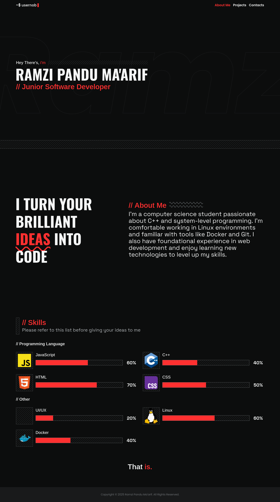
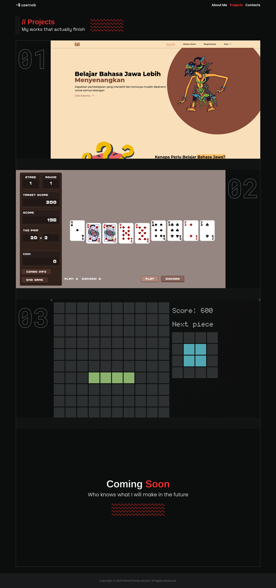
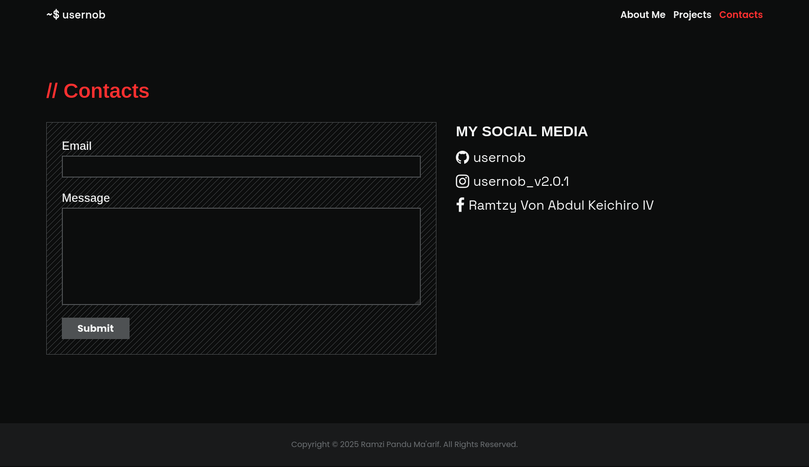

# Personal Website Portofolio
> bukankah ini my website

Ini adalah website statis sederhana yang dibangun hanya dengan html, css dengan bantuan
tailwind, dan javascript murni

## Screenshot






## Cara build
Untuk yang ingin menjalankan website ini secara lokal maka ada beberapa langkah
yang perlu dilakukan dahulu

### clone repositori
```sh
git clone https://github.com/usernob/my-portofolio.git
cd my-portofolio
```
### install tailwind
```sh
npm install
```

### build tailwind css
```sh
npm run build
```

Setelah ini akan tergenerate file `src/output.css`. Sekarang websitenya sudah bisa dijalankan dengan web server favoritmu

- [Link Demo](https://usernob.github.io/my-portofolio)
- [Link Youtube](https://youtu.be/63nS_F4ke0g)
